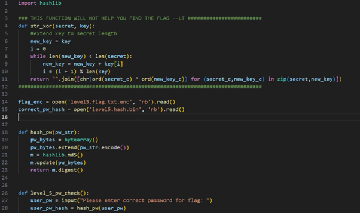
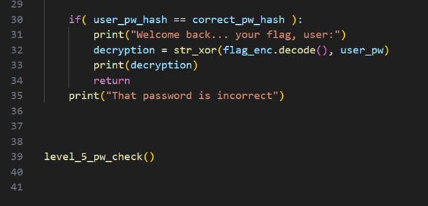
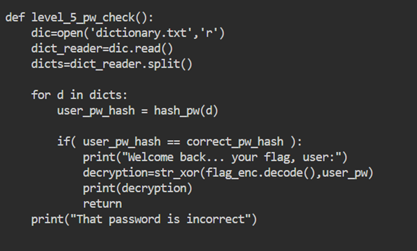
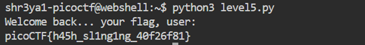

# Description 
Can you crack the password to get the flag?
Download the password checker here and you'll need the encrypted flag and the hash in the same directory too. Here's a dictionary with all possible passwords based on the password conventions we've seen so far.

# Solution 

The password checker is a python code.   

  
I edit the code so that the all the passwords from **dictionary.txt** are tested.  
  
When one of these passwords worked, I got the flag.  

