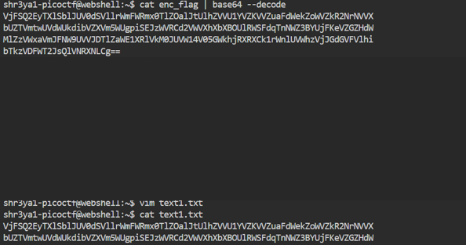

# Description 
Can you make sense of this file?
Download the file here.

# Solution
  The file contains the following text:  

  
The text is base64 encoded several times, so we must decode it several times till we get the flag.  

  
The flag is found at the end: 
### picoCTF{base64_n3st3d_dic0d!n8_d0wnl04d3d_4557ec3e}
