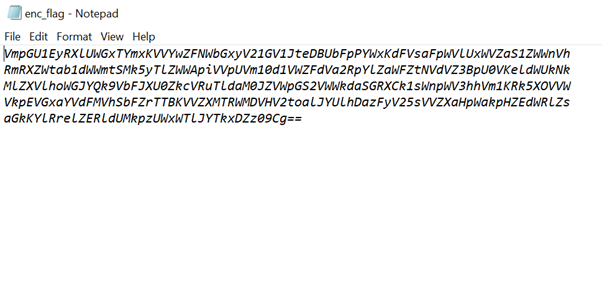
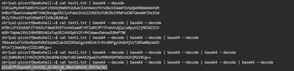

# Description 
Can you make sense of this file?
Download the file here.

# Solution
  The file contains the following text:  

  
The text is base64 encoded several times, so we must decode it several times till we get the flag.

The flag is found at the end.
