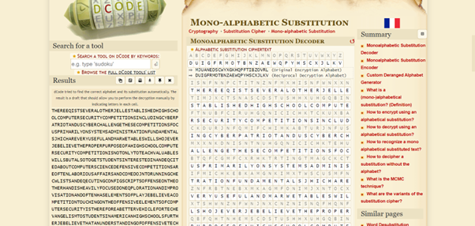

# Description 
It seems that another encrypted message has been intercepted. The encryptor seems to have learned their lesson though and now there isn't any punctuation! Can you still crack the cipher?
Download the message here.
  
# Solution 
Message.txt contains:  
isnfnnpctitnznfmxhisnfwnxxntimjxctsnascdstushhxuhgqbinftnubfciruhgqnicichktckuxbackdurjnfqmifchimkabturjnfusmxxnkdnisntnuhgqnicichktehubtqfcgmfcxrhktrtingtmagckctifmichkebkamgnkimxtwscusmfnznfrbtnebxmkagmfonimjxntocxxtshwnznfwnjnxcnznisnqfhqnfqbfqhtnhemscdstushhxuhgqbinftnubfciruhgqnicichkctkhihkxrihinmuszmxbmjxntocxxtjbimxthihdnitibankitckinfntinackmkanpucinamjhbiuhgqbinftucnkunanenktcznuhgqnicichktmfnheinkxmjhfchbtmeemcftmkauhgnahwkihfbkkckdusnuoxctitmkanpnubickduhkecdtufcqitheenktnhkisnhisnfsmkactsnmzcxrehubtnahknpqxhfmichkmkacgqfhzctmichkmkaheinksmtnxngnkitheqxmrwnjnxcnznmuhgqnicichkihbusckdhkisnheenktcznnxngnkitheuhgqbinftnubfcirctisnfnehfnmjniinfznscuxnehfinusnzmkdnxctgihtibankitckmgnfcumkscdstushhxtebfisnfwnjnxcnznismimkbkanftimkackdheheenktczninuskcvbntctnttnkicmxehfghbkickdmkneenuicznanenktnmkaismiisnihhxtmkauhkecdbfmichkehubtnkuhbkinfnackanenktcznuhgqnicichktahntkhixnmatibankitihokhwisncfnkngrmtneenuicznxrmtinmusckdisngihmuicznxrisckoxconmkmiimuonfqcuhuiectmkheenktcznxrhfcnkinascdstushhxuhgqbinftnubfciruhgqnicichkismitnnotihdnknfminckinfntickuhgqbinftucnkunmghkdscdstushhxnftinmusckdisngnkhbdsmjhbiuhgqbinftnubfcirihqcvbnisncfubfchtcirghiczmickdisngihnpqxhfnhkisncfhwkmkankmjxckdisngihjniinfanenkaisncfgmusckntisnexmdctqcuhUIE{K6F4G_4K41R515_15_73A10B5_702E03EU}
 
Using a mono-alphabetic substituion decoder, I got the flag. 

  
THEREEQISTSEVERALOTHERJELLESTABLISHEDHIGHSCHOOLCOMPUTERSECURITYCOMPETITIONSINCLUDINGCYBERPATRIOTANDUSCYBERCHALLENGETHESECOMPETITIONSFOCUSPRIMARILYONSYSTEMSADMINISTRATIONFUNDAMENTALSJHICHAREVERYUSEFULANDMARWETABLESWILLSHOJEVERJEBELIEVETHEPROPERPURPOSEOFAHIGHSCHOOLCOMPUTERSECURITYCOMPETITIONISNOTONLYTOTEACHVALUABLESWILLSBUTALSOTOGETSTUDENTSINTERESTEDINANDEQCITEDABOUTCOMPUTERSCIENCEDEFENSIVECOMPETITIONSAREOFTENLABORIOUSAFFAIRSANDCOMEDOJNTORUNNINGCHECWLISTSANDEQECUTINGCONFIGSCRIPTSOFFENSEONTHEOTHERHANDISHEAVILYFOCUSEDONEQPLORATIONANDIMPROVISATIONANDOFTENHASELEMENTSOFPLAYJEBELIEVEACOMPETITIONTOUCHINGONTHEOFFENSIVEELEMENTSOFCOMPUTERSECURITYISTHEREFOREABETTERVEHICLEFORTECHEVANGELISMTOSTUDENTSINAMERICANHIGHSCHOOLSFURTHERJEBELIEVETHATANUNDERSTANDINGOFOFFENSIVETECHNIXUESISESSENTIALFORMOUNTINGANEFFECTIVEDEFENSEANDTHATTHETOOLSANDCONFIGURATIONFOCUSENCOUNTEREDINDEFENSIVECOMPETITIONSDOESNOTLEADSTUDENTSTOWNOJTHEIRENEMYASEFFECTIVELYASTEACHINGTHEMTOACTIVELYTHINWLIWEANATTACWERPICOCTFISANOFFENSIVELYORIENTEDHIGHSCHOOLCOMPUTERSECURITYCOMPETITIONTHATSEEWSTOGENERATEINTERESTINCOMPUTERSCIENCEAMONGHIGHSCHOOLERSTEACHINGTHEMENOUGHABOUTCOMPUTERSECURITYTOPIXUETHEIRCURIOSITYMOTIVATINGTHEMTOEQPLOREONTHEIROJNANDENABLINGTHEMTOBETTERDEFENDTHEIRMACHINESTHEFLAGIS
__PICOCTF{N6R4M_4N41Y515_15_73D10U5_702F03FC}__
 
The flag is found at the end of this text.
