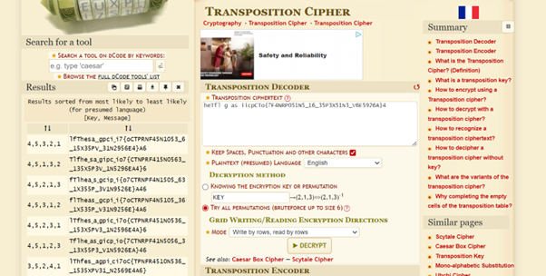

# Description 
Our data got corrupted on the way here. Luckily, nothing got replaced, but every block of 3 got scrambled around! The first word seems to be three letters long, maybe you can use that to recover the rest of the message.
Download the corrupted message here. 

# Solution
The message contains the following text:  
heTfl g as iicpCTo{7F4NRP051N5_16_35P3X51N3_V6E5926A}4  

Using a transposition cipher, I tried various permutations.  

 2,4,1,5,6,3 was Th␣eflagi␣s␣piocCTF{R74N5P501N6_51_3XPN351V35_6E6942A}. 
Using 1,2,4,3,5,6 for each block of 6, I got the flag: 
__The␣flag␣is␣picoCTF{7R4N5P051N6_15_3XP3N51V3_56E6924A}__

