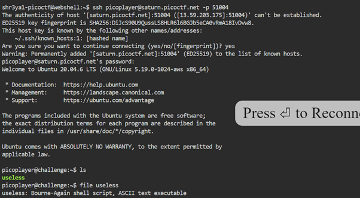

# Description 
There's an interesting script in the user's home directory
Additional details will be available after launching your challenge instance.
 
# Solution 
The hostname, port number, user and password are given for the instance once it is launched.  
Hostname: saturn.picoctf.net 
Port:     51004 
Username: picoplayer 
Password: password  

 

I see a file useless, it is an executable file with ASCII text. 
I see the contents of the file and at the end, it says to Read the manual. 
Using man useless, the flag is found at the end. 
